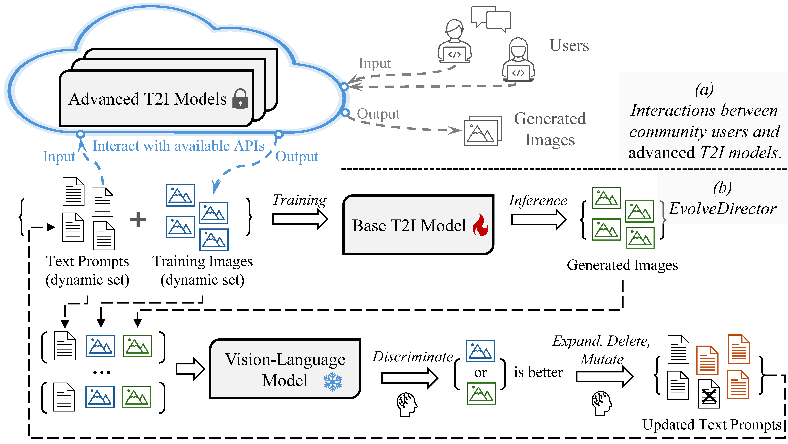

<p align="center">
  
</p>

### <div align="center">EvolveDirector: Approaching Advanced Text-to-Image Generation with Large Vision-Language Models<div> 

<div align="center">

  <a href=" "></a> &ensp;
  <a href="https://huggingface.co/ruizhaocv/Edgen"></a> &ensp;


</div>

---
## Method

<p align="center">
  
</p>


## Setup

### Requirements

1. Firstly git clone this repo.

2. Build virtual environment for EvolveDirector
```shell
# create virtual environment for EvolveDirector
conda create -n evolvedirector python=3.9
conda activate evolvedirector

# cd to the path of this repo

# install packages
pip install --upgrade pip 
pip install torch==2.1.1 torchvision==0.16.1 torchaudio==2.1.1 --index-url https://download.pytorch.org/whl/cu121
pip install -r requirements.txt
pip install -U transformers accelerate diffusers SentencePiece ftfy beautifulsoup4
```
3. Build virtual environment for LLava
```shell
# Clone LLaVA repo
git clone https://github.com/haotian-liu/LLaVA.git
cd LLaVA

# create virtual environment 
conda create -n llava python=3.10 -y
conda activate llava

# install packages
pip install --upgrade pip  # enable PEP 660 support
pip install -e .

```

### Model Weights
1. Download our Edgen model weights, VAE and T5 weights at: https://huggingface.co/ruizhaocv/Edgen. Change the path to the weights in the scripts "AdGenerator/base_img_gen.py", "AdGenerator/extract_features.py", and training configs.

2. Download LLava weights at: https://huggingface.co/liuhaotian/llava-v1.6-34b. Change the path to the weights in the script "VLM/vlm_script.py". Download the clip: https://huggingface.co/openai/clip-vit-large-patch14-336, and put it under the same parent folder with LLava weights.

3. Download the advanced model weights, for example the Playground 1.5 at: https://huggingface.co/playgroundai/playground-v2.5-1024px-aesthetic. Change the path to the weights in the script "AdGenerator/advanced_gen_scripts/img_gen_playground.py".


## Usage

1. 512px with single scale training
```shell
# For example, if you have 8 gpu cards

# 1. run the synchronizer
CUDA_VISIBLE_DEVICES=0 python Synchronizer/server.py --task_stamp dynamic_0000

# 2. run the image generation scripts
CUDA_VISIBLE_DEVICES=0 python AdGenerator/base_img_gen.py --task_stamp dynamic_0000
CUDA_VISIBLE_DEVICES=1 python AdGenerator/advanced_img_gen.py --task_stamp dynamic_0000
CUDA_VISIBLE_DEVICES=1 python AdGenerator/advanced_gen_scripts/img_gen_playground.py --task_stamp dynamic_0000 --rank 0

# 3. run the VLM server and scripts. Note: use the llava environment
CUDA_VISIBLE_DEVICES=2 python VLM/vlm_server.py --task_stamp dynamic_0000
CUDA_VISIBLE_DEVICES=2 python VLM/vlm_script.py --task_stamp dynamic_0000  --rank 0

# 4. optional: run the extract features scirpt
CUDA_VISIBLE_DEVICES=3 python /mnt/data/ruizhao/code/EvolveDirector/AdGenerator/extract_features.py --task_stamp dynamic_0000 


# 5. run the training script on sigle card
CUDA_VISIBLE_DEVICES=4 python Train/train.py configs/evolve_director_512.py --work-dir output/evolve_director_512 --task_stamp dynamic_0000

# 5. run the training script on multiple cards
CUDA_VISIBLE_DEVICES=4, 5, 6, 7 python -m torch.distributed.launch --nproc_per_node=4 Train/train.py configs/evolve_director_512.py --work-dir output/EvolveDirector_512 --task_stamp dynamic_0000

```

2. 1024px with multiple scale training
```shell
# 3. change the VLM server and scripts to multi-scale. Note: use the llava environment
CUDA_VISIBLE_DEVICES=2 python VLM/vlm_script.py --task_stamp dynamic_0000  --rank 0 --multi_scale

# 4. optional: change the extract features scirpt to multi-scale
CUDA_VISIBLE_DEVICES=3 python /mnt/data/ruizhao/code/EvolveDirector/AdGenerator/extract_features.py --task_stamp dynamic_0000 --img_size 1024 --multi_scale

# 5. multi-scale training script
CUDA_VISIBLE_DEVICES=4 python Train/train.py configs/evolve_director_1024.py --work-dir output/evolve_director_1024 --task_stamp dynamic_0000

CUDA_VISIBLE_DEVICES=4, 5, 6, 7 python -m torch.distributed.launch --nproc_per_node=4 Train/train.py configs/evolve_director_1024.py --work-dir output/evolve_director_1024 --task_stamp dynamic_0000
```


3. Inference
```shell
python Inference/inference.py --image_size=1024 \
    --t5_path "/path/to/Edgen" \
    --tokenizer_path "/path/to/Edgen/sd-vae-ft-ema" \
    --txt_file "Inference/text_prompts.txt" \
    --model_path "/path/to/Edgen/ckpt.pth" \
    --save_folder "output/test_model"
```

4. Others
```shell
# Prepare your own start data
python AdGenerator/advanced_gen_scripts/inference_toy.py

# Extract features before training to save memory and time

# 512px
python tools/extract_features.py --img_size=512 \
    --json_path "/path/to/data.json" \
    --t5_save_root "/path/to/save/caption_feature_wmask" \
    --vae_save_root "/path/to/save/img_vae_features" \
    --pretrained_models_dir "/path/to/Edgen" \
    --dataset_root "/path/to/images"

# 1024px
python tools/extract_features.py --img_size=1024 \
    --multi_scale \
    --json_path "/path/to/data.json" \
    --t5_save_root "/path/to/save/caption_feature_wmask" \
    --vae_save_root "/path/to/save/img_vae_features" \
    --pretrained_models_dir "/path/to/Edgen" \
    --dataset_root "/path/to/images"
```


## Citation


```bibtex


```

## Shoutouts

- This code builds heavily on [PixArt-$\alpha$](https://github.com/PixArt-alpha/PixArt-alpha/). Thanks for open-sourcing!


